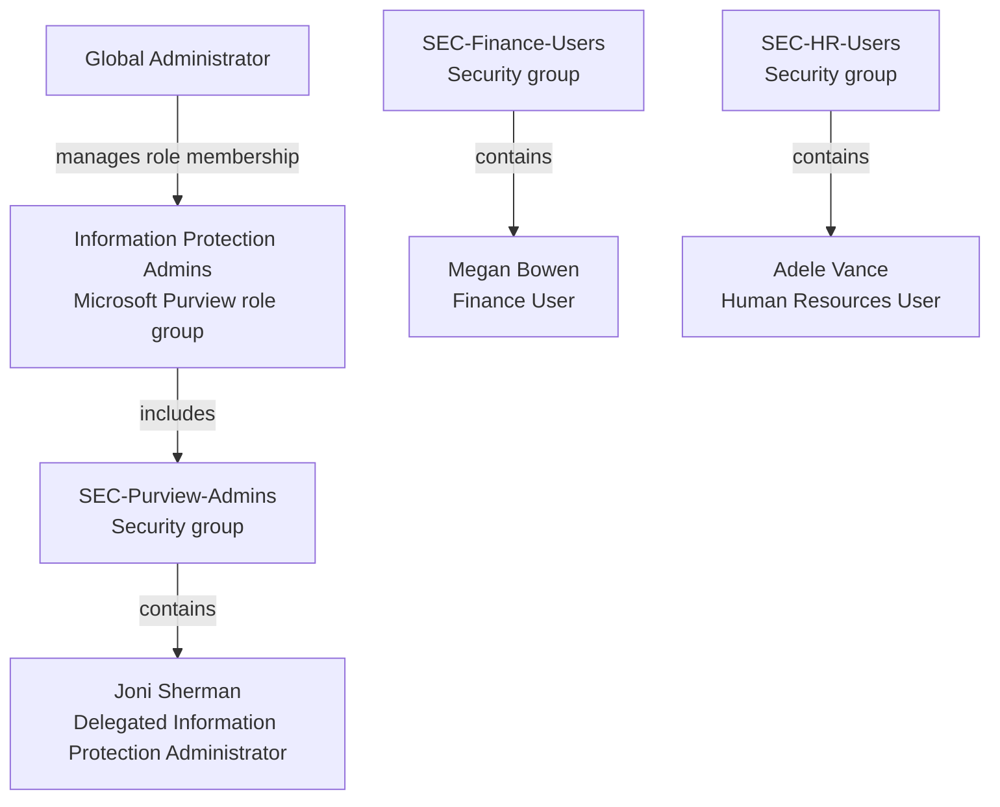

# Identity and Access Management

This document describes the identity, group and delegated administration architecture implemented in the Enterprise Security Lab.

The objective is to provide a realistic Microsoft 365 identity model based on role separation, group-based administration and the principle of least privilege.

## Objectives

The identity architecture is designed to:

- Separate administrative and business-user responsibilities
- Avoid direct assignment of excessive privileges
- Use security groups for scalable access management
- Support Microsoft Purview administration
- Provide test identities for Finance and Human Resources scenarios
- Enable future Information Protection and Data Loss Prevention testing

## Environment

- Microsoft 365 E3 test tenant
- Microsoft Entra ID
- Microsoft Purview
- Synthetic identities and business data
- No production users or corporate information

## Identity Architecture

| Identity | Business function | Access level | Purpose |
|---|---|---|---|
| Global Administrator | Tenant administration | Privileged administrator | Initial tenant configuration and administrative oversight |
| Joni Sherman | Information Security | Delegated Purview administrator | Information Protection and Purview administration |
| Megan Bowen | Finance | Standard user | Finance-related data protection and DLP testing |
| Adele Vance | Human Resources | Standard user | HR-related data protection and DLP testing |

All laboratory identities use synthetic names and are restricted to the test environment.

## Security Groups

| Security group | Member | Business scope | Security purpose |
|---|---|---|---|
| `SEC-Purview-Admins` | Joni Sherman | Information Security | Delegated Microsoft Purview Information Protection administration |
| `SEC-Finance-Users` | Megan Bowen | Finance | Scope Finance data classification, sensitivity labels and DLP controls |
| `SEC-HR-Users` | Adele Vance | Human Resources | Scope employee-data protection, sensitivity labels and DLP controls |

The Global Administrator owns the administrative security group and retains responsibility for tenant-level configuration.

`SEC-Purview-Admins` is assigned to the Microsoft Purview **Information Protection Admins** role group. Consequently, Joni Sherman receives delegated Purview permissions through group membership rather than through a direct individual role assignment.

Finance and Human Resources identities remain standard users without administrative privileges.

## Role Assignment Model

### Access Model Summary

- Tenant administration remains separated from operational Information Protection administration.
- Purview permissions are granted through security-group membership.
- Finance and Human Resources users retain standard-user access.
- Future sensitivity-label and DLP policies will use departmental groups as deployment scopes.

## Security Principles

### Principle of Least Privilege

Users receive only the access required for their laboratory function.

Joni Sherman is not assigned the Global Administrator role. Her access is limited to the Microsoft Purview responsibilities required for Information Protection administration.

### Role Separation

Tenant-level administration is separated from operational Information Protection administration.

Business users remain standard users and do not receive administrative permissions.

### Group-Based Access Management

Permissions and future policy scopes are assigned through security groups rather than through individual assignments.

This approach improves:

- Scalability
- Consistency
- Auditability
- Access reviews
- User lifecycle management

### Synthetic Data

All users, documents and sensitive-data samples used in the laboratory are synthetic.

No production credentials, personal information, customer data or confidential corporate information are used.

## Implementation Status

- [x] Microsoft 365 test identities created
- [x] Finance and HR profiles configured
- [x] Administrative security group created
- [x] Departmental security groups created
- [x] Users assigned to their respective groups
- [x] `SEC-Purview-Admins` assigned to `Information Protection Admins`
- [ ] Delegated administrator login validation
- [ ] Multi-Factor Authentication validation
- [ ] Conditional Access design
- [ ] Manual access review procedure
- [ ] Microsoft Entra Access Reviews assessment *(requires eligible Microsoft Entra ID P2, Entra ID Governance, Entra Suite or trial licensing)*
- [ ] Privileged Identity Management assessment *(requires eligible Microsoft Entra ID P2, Entra ID Governance, Entra Suite or trial licensing)*

## Planned Validation

The following tests will be performed:

1. Sign in with the delegated Purview administrator.
2. Confirm access to Microsoft Purview Information Protection features.
3. Verify that the delegated administrator does not have Global Administrator privileges.
4. Confirm that Finance and HR identities remain standard users.
5. Publish sensitivity labels to the appropriate security groups.
6. Scope DLP policies to Finance and Human Resources scenarios.
7. Document successful-access and access-denied results.

## Evidence Management

Screenshots and implementation evidence will be stored only after:

- Tenant identifiers have been reviewed.
- Credentials and secrets have been removed.
- Personal or sensitive information has been anonymized.
- The evidence has been validated for public publication.

## Related Documentation

- [Enterprise Security Lab](../../README.md)
- Information Protection documentation — Planned
- Data Loss Prevention documentation — Planned
- Governance and compliance documentation — Planned
